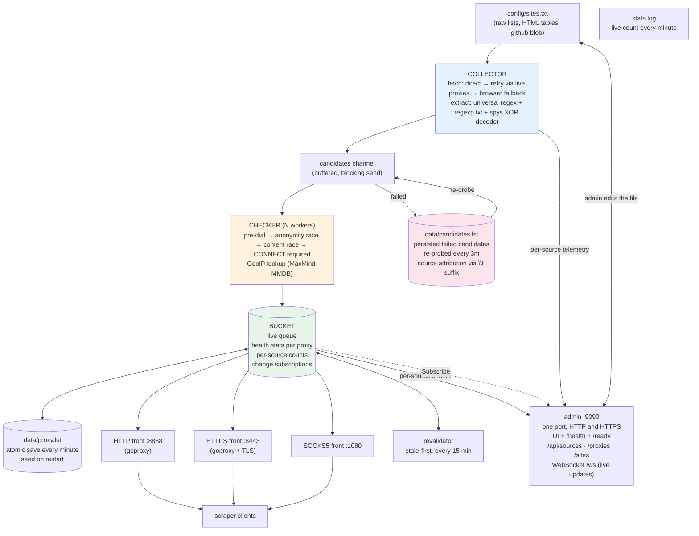
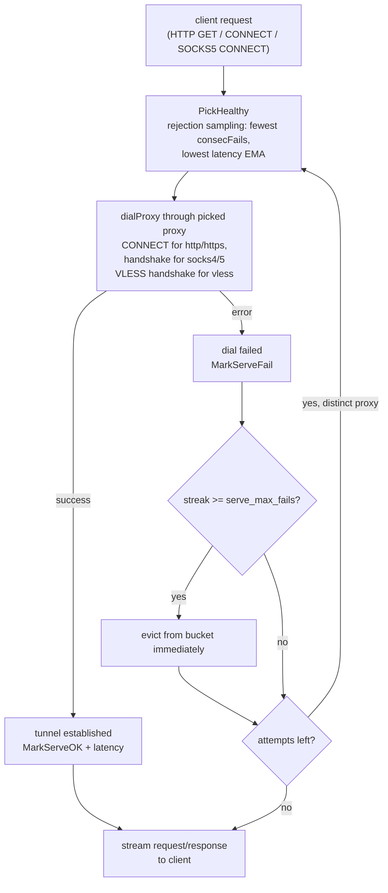
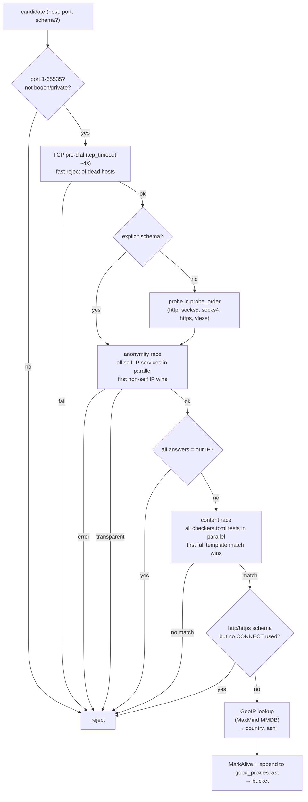

# Architecture

Principled block scheme of the application. Code map: entrypoint `main/proxy.go`, all logic in `proxy/`.

## 1. Whole system



Every arrow into `BUCKET` from serving traffic also carries health feedback back
(success resets the failure streak, failure increments it, threshold evicts).

The collector carries each candidate's **source URL** into the bucket, and
`SiteRegistry` (`proxy/sitestats.go`) keeps the verdict per source: how many
candidates it produced, how many of them are still in the queue, consecutive
fetch failures and the resulting cooldown. Sites are visited in that priority
order, so a source that used to work and stopped is skipped for
`site_cooldown` and a source nobody has fetched yet still gets its turn. This
is what makes the list self-pruning instead of a pile of links that stopped
resolving years ago.

## 2. One client request (serving path)

Same for all three fronts; only the entry protocol differs.



Key property: **each request builds a fresh upstream selection**; the transport
uses `DisableKeepAlives`, so no tunnel is ever reused across requests. Retrying
the dial is safe — no request bytes have been sent at that point.

Both tunnel kinds carry a **first-byte probe** so a blackholed upstream is
abandoned in ~3s instead of burning the whole response budget:

- CONNECT tunnels: `serve_connect_probe` — after "200 Connection established"
  the far target must produce a byte, else the tunnel is re-established through
  a different proxy with the client's early bytes replayed.
- plain HTTP: `serve_response_probe` — after the dial, the far side must produce
  the first response byte, else the attempt is abandoned and retried elsewhere.
  The deadline is cleared by the first byte that arrives, so a slow-but-working
  proxy is unaffected; only silence is fatal. Armed only on the HTTP front-end
  dial path (`dialHTTP`), never on SOCKS5 tunnels, which are long-lived.

### 2.1 Choosing the upstream (why the picker has tiers)

The queue is mostly unproven. After a restart it is seeded from `proxy.lst`
with tens of thousands of entries that nobody has verified *in this process
lifetime*, while the working set is typically a few thousand. Uniform sampling
over that queue lands on an unvalidated proxy almost every time, and no amount
of rejection sampling rescues a 1% minority. So `PickHealthy` samples by
strength of evidence:

1. **`hot`** — the curated tail: served real traffic, or just validated. Bounded
   by `hotMax`.
2. **proven pool** (`freshPool`) — anything with a proof of life newer than
   `pick_fresh_window`. Cached and rebuilt at most every 2s, because the rebuild
   is an O(queue) scan and must not run per pick.
3. **whole queue** — only when the preferred tiers yield nothing usable.

Within a tier, candidates are ordered by proof freshness, then consecutive
failures, then latency EMA, then in-flight load. A latency of 0 means *never
measured* and loses to any measured entry — otherwise an unproven entry with no
samples can win a pick outright.

`pick_fresh_window` must outlast `storage.revalidate_interval`. Between two
revalidation passes the freshly-validated set is all the picker has to aim at;
a shorter window empties it, and every client request quietly falls back to the
unverified bulk. `fillDefaults` warns when the two conflict.

## 3. Validation of one candidate



Worst-case cost of one check ≈ one `TotalT` (stages race internally), not the sum
of all service/test timeouts. Sub-requests of a check share one keep-alive
transport bound to that proxy.

### 3.1 VLESS validation

For `schema="vless"` the checker:
1. Uses `dialVLESS` transport (uTLS with Chrome fingerprint)
2. If `pbk` present → REALITY handshake (x25519 + HKDF-SHA256)
3. Standard VLESS handshake (UUID + command + target address)
4. Content tests race through the established VLESS tunnel
5. On success: `MarkAlive` + `SetGeoIP(exitIP)` + `SetVLESS(uuid, flow, sni, pbk, sid, spider)`

## 4. Components

| Component | File | Role |
|-----------|------|------|
| Entrypoint | `main/proxy.go` | Loads config, seeds bucket, starts checker workers, collector, revalidator, saver, stats logger, 3 listeners + admin. Helpers: `buildGoproxy`, `saveQueue`. The validation pipeline itself (`RunCheckLoop`, `RevalidateSeeded`) lives in `proxy/pipeline.go`. |
| Bucket | `proxy/bucket.go` | Concurrency-safe live queue, dedup by full URL, `Random` (uniform, collectors/retries use it), `PickHealthy` (weighted, serving path uses it), curated `hot` tail plus the cached proven pool (`freshPool`), per-source counts, `LiveList`/`LiveListPage` (hot/served/checked/all), `Subscribe` change notifications (a subscriber list — the forward dialer and the admin WebSocket both register, neither replaces the other). |
| ForwardDialer | `proxy/upstream.go` | `DialContext` with failover + passive feedback; `loop` set dials known-proxy addresses directly (anti self-loop); `NewTransport` (no keep-alives). |
| Dials | `proxy/dial.go` | `connectHTTPProxy` (CONNECT, optional TLS for `https:` proxies), `socksDialTimeout` (timeout wrapper), `dialVLESS` (uTLS + REALITY + VLESS handshake), `socksDialTimeout` (timeout wrapper that closes late connections). |
| Checker | `proxy/checker.go` | Section 3. Shared per-check keep-alive client; stamps `MarkAlive` on success; GeoIP lookup via MaxMind MMDB. |
| Collector | `proxy/collector.go` | Section 1 left side. Cookie jar, browser-grade headers, 429/503 + `Retry-After`, binary content-type guard, per-site cooldown, priority-ordered site walk with `max_sites_per_cycle` / `max_candidates_per_site` caps, JS-protection hints in logs, blocking `emit`. |
| Site telemetry | `proxy/sitestats.go` | `SiteRegistry`: per-source emitted/found/alive/fails, cooldown, deterministic rotation of untried sources, bounded to 200k tracked URLs. |
| Extractor | `proxy/extract.go` | Universal `scheme://ip:port`, bare `ip:port`, `[ipv6]:port`, spys XOR decoder, `document.write` JS reconstruction (`proxy/jswrite.go`), then `regexp.txt` patterns (2 groups either order, or 1 group + `portBefore`). |
| Proxy model | `proxy/model.go` | `Proxy` + lock-free (`sync/atomic`) health stats: `consecFails`, `okTotal`/`failTotal`, latency EMA, `lastCheck`/`lastOK`, `source`. VLESS fields: `UUID`, `Flow`, `SNI`, `Pbk`, `Sid`, `Spider`. GeoIP: `Country`, `ASN`. `Candidate`, `ParseProxyLine`. |
| Storage | `proxy/store.go` | `LoadSites` (BOM strip, normalize, dedup), `SiteList` (`LoadSiteList`/`Add`/`Remove`/`Render`/`SaveSiteList` with `.bak` for the admin editor), `ReadQueue`, `LoadRegexLines`, atomic `SaveBucketAtomic`, `AppendGood`. |
| Candidate Pool | `proxy/pool.go` | Persisted failed candidates with source attribution (`addr\t<source-url>`). Rotating re-probe (`Batch`), `Good()` marks validated entries. Caps at `max_candidates`: the oldest line is evicted to make room (never a newly discovered one), the file is trimmed to the tail on load and periodically compacted so it cannot outgrow the cap. |
| SOCKS5 front | `proxy/socks5_server.go` | Minimal RFC 1928 server, tunnels each session via `ForwardDialer`, idle-deadline relay. Volume-aware verdict (`relayCount`). |
| TLS | `proxy/tlsutil.go` | Load cert/key from disk or generate ephemeral self-signed. |
| Browser fallback | `proxy/browser.go` | Lazy headless Chromium via playwright (off by default). |
| Admin | `main/admin.go`, `main/adminapi.go`, `main/adminassets.go` | `mixedListener` (0x16 sniffing, one port for HTTP and HTTPS), `routes`, source/live/site handlers, embedded page, WebSocket `/ws`. |
| Logging | `main/logfiles.go`, `main/logging.go` | Per-category rotating sinks + `noiseWriter` (drops stdlib TLS-handshake noise, coalesces the goproxy dial-warn flood). `fileLogSink` backstop drops TLS handshake noise. |
| Config | `proxy/config.go` | TOML structs + `fillDefaults` + `LoadTests`. |

## 5. Data lifecycle

```
sites.txt → candidates (10-min seenRecently dedup, each tagged with its
          source URL) → validated → bucket (+ good_proxies.last audit)
          → proxy.lst (atomic rewrite each minute, only when the queue changed)
          → on restart: ReadQueue → Seed → priority
            revalidation of the old queue while the first collection cycle runs.

Dead proxies leave the queue through three paths:
  - failed revalidation (stale-first, every 15 min)
  - serving-path failure streak (serve_max_fails)
  - capacity eviction (max_proxies, oldest-ish first, reported to subscribers)

Candidates that fail validation go to candidates.lst (with source attribution).
Pool re-probe loop emits up to pool_retry_batch every pool_retry_interval,
respecting channel backpressure (non-blocking emit, logs skips).

Sites leave sites.txt by hand (admin page) or by accumulating site_max_fails
fetch failures, which puts them on a site_cooldown. The list is not pruned
automatically — the cooldown is what stops wasted fetches, and deleting a line
is the operator's decision, informed by /api/sources.
```

## 6. Admin surface

One port (`server.admin_listen`, `127.0.0.1:9090` by default) answers **both**
HTTP and HTTPS: `mixedListener` reads the first byte of every connection and
wraps it in `tls.Server` when it is `0x16`. That is the fix for a browser
pointed at `https://127.0.0.1:9090/` getting `ERR_SSL_RECORD_TOO_LONG` from a
plaintext listener. No auth, no proxy traffic — keep it on loopback.

| Route | Purpose |
|-------|---------|
| `GET /` | Page with three tabs: live proxies, per-source stats, `sites.txt` editor. |
| `GET /health` | Queue/pool counters as JSON, plus whether the request came in over TLS. |
| `GET /ready` | 200 while the queue can serve, 503 otherwise. |
| `GET /api/sources` | One row per tracked source: alive, yield %, emitted, found, cycles, fails, cooldown, last note. |
| `GET /api/proxies?scope=…` | `hot` (curated tail), `served` (carried real traffic), `checked` (validated recently), `all` (whole queue). `&format=text|csv|jsonl`, `&country=US`, `&asn=AS12345`. |
| `GET/POST/DELETE /api/sites` | Read and edit `sites.txt` in place: validated, normalized, atomic write, `.bak` kept, empty list refused. Bulk delete via `DELETE` with `{"urls": [...]}`. |
| `POST /api/proxies/revalidate` | Force revalidation of selected proxies: `{"urls": [...], "keys": [...]}`. |
| `GET /api/stats/history` | 24h stats history (1 sample/min = 1440 points): queue_live, queue_hot, pool_candidates. |
| `GET /ws` | WebSocket for live updates. Pushes `{"type":"state"|"update", health, proxies, sources, history}`; bucket changes are coalesced into at most one delta per second. |

Liveness definitions are deliberately explicit because "the proxy list said so"
is not the same as "it works": `hot` is the set the picker actually samples,
`served` means a real client request went through it inside the window,
`checked` means a full validation did, and `all` includes entries that have
never been proven. `Bucket.LiveList` implements the same scopes for code.

## 7. Background loops

| Loop | File | Interval | Purpose |
|------|------|----------|---------|
| `saveLoop` | `main/loops.go` | `storage.save_interval` (1m) | Atomic rewrite of `proxy.lst`, only while the queue is dirty (the dirty flag is set by `Add`/`Remove`). |
| `statsLoop` | `main/loops.go` | 1 min | Log `queue: live proxies = N (hot M)`. After 2 empty minutes → emergency collector wake. |
| `PoolReprobeLoop` | `proxy/poolloop.go` | `collector.pool_retry_interval` (3m) | Emit `pool_retry_batch` (1000) candidates from pool, non-blocking, adaptive room check. |
| `RevalidateLoop` | `proxy/revalidate.go` | `storage.revalidate_interval` (15m) | Stale-first revalidation of bucket, capped at `revalidate_max_per_pass` (30k). Skips recently-served (`revalidate_fresh_servers`). |
| `statsRecorder` (admin) | `main/adminapi.go` | 1 min | Ring buffer of 1440 samples for `/api/stats/history` and WebSocket. |
| `startWSNotifier` (admin) | `main/adminapi.go` | 1 s tick | Coalesces bucket-change flags into at most one delta broadcast per tick. |

## 8. Candidate Pool persistence

File format: `host:port` or `scheme://host:port` optionally followed by `\t<source-url>`.
The source suffix is metadata only — it restores the candidate's attribution on
re-probe so a late validation still credits the real site instead of a fake
"pool" entry. Lines without the suffix (legacy pool files) load with an empty
source and stay unattributed — honest, unlike inventing one.

`Good()` matches by proxy key regardless of the suffix.

Capacity: the pool holds up to `collector.max_candidates` entries (and
`storage.max_bytes` of file). It rotates instead of going dead at the cap —
the oldest line is evicted to make room for a newly discovered failure, so
the re-probe always works on a mix of recent candidates rather than a frozen
set. The file is append-only while rotating; every `8192` evictions (and on
load, if an older build left the file over the cap) it is rewritten from
memory (temp + fsync + rename) so disk never drifts ahead of RAM. A
deliberately oversized production file (391k lines under a 200k cap) loads
trimmed to its freshest tail instead of refusing every subsequent `Add`.

## 9. VLESS / REALITY details

### 9.1 VLESS handshake packet (client → server)
```
version (1) = 0
uuid (16 bytes)
command (1) = 1 (TCP connect)
addon_len (2) = 0
address: type(1) + len(1) + data (IPv4=1/4B, Domain=2/len+name, IPv6=3/16B)
port (2 bytes, big endian)
```

### 9.2 REALITY handshake
1. Client generates ephemeral x25519 keypair
2. Shared secret = X25519(priv_client, pbk_server)
3. Keys = HKDF-SHA256(salt=sid, ikm=shared, info="reality")
4. uTLS Client (Chrome HelloID) sends encrypted ClientHello using derived keys
5. Server decrypts, validates, completes TLS handshake

### 9.3 uTLS fingerprinting
Uses `github.com/refraction-networking/utls` with `HelloChrome_Auto` to match
real browser TLS fingerprint. REALITY servers validate the fingerprint before
decrypting the ClientHello.

## 10. GeoIP integration

- Optional: `checker.geoip_db_path = "GeoIP2-City.mmdb"` in config
- On successful validation: `c.geoDB.City(exitIP)` → `Proxy.SetGeoIP(country, "")`
- Admin API: `/api/proxies?country=US&asn=AS12345`
- Export formats include `country` column

## 11. Configuration reference (key tunables)

### `[server]`
| Key | Default | Description |
|-----|---------|-------------|
| `listen` / `listen_https` | `0.0.0.0:8888` / `0.0.0.0:8443` | HTTP/HTTPS proxy ports |
| `max_proxies` | 2,000,000 | Live queue cap |
| `serve_retries` | 3 | Failover attempts per request |
| `serve_max_fails` | 3 | Consecutive failures before eviction |
| `pick_probes` | 8 | Rejection sampling probes per pick |
| `pick_serve_window` | 90s | Recent serving proof window |
| `pick_fresh_window` | 20m | Recent validation proof window |
| `serve_total_timeout` | 25s | Total budget per request |
| `serve_connect_probe` | 3s | CONNECT first-byte deadline |
| `serve_response_probe` | 3s | HTTP first-byte deadline |
| `admin_listen` | `127.0.0.1:9090` | Admin UI (empty = disabled) |

### `[checker]`
| Key | Default | Description |
|-----|---------|-------------|
| `workers` | 600 | Parallel validation workers |
| `channel_size` | 10,000 | Candidate channel buffer |
| `tcp_timeout` | 34s | TCP pre-dial timeout |
| `connect_timeout` | 30s | TLS handshake / proxy dial timeout |
| `response_timeout` | 60s | HTTP response timeout |
| `total_timeout` | 230s | Total validation timeout |
| `probe_order` | `["http","socks5","socks4","https"]` | Protocol probe order |
| `require_stable_exit` | true | Reject rotating exit IPs |
| `e2e_probe` | true | End-to-end tunnel test |
| `geoip_db_path` | "" | Path to MaxMind GeoIP2-City.mmdb |

### `[collector]`
| Key | Default | Description |
|-----|---------|-------------|
| `fetch_workers` | 10 | Parallel site fetches |
| `fetch_retries` | 5 | Retry via live proxies on failure |
| `http_timeout` | 45s | Site fetch timeout |
| `cycle_sleep` | 25m | Pause between collection cycles |
| `max_sites_per_cycle` | 60 | Sources fetched per cycle (priority order) |
| `max_candidates_per_site` | 1000 | Cap per source per cycle |
| `pool_retry_batch` | 1000 | Pool re-probe batch size |
| `pool_retry_interval` | 3m | Pool re-probe interval |
| `use_browser` | false | Playwright fallback (off by default) |

### `[storage]`
| Key | Default | Description |
|-----|---------|-------------|
| `queue_file` | `proxy.lst` | Live queue persistence |
| `good_file` | `good_proxies.last` | Append-only audit of all accepted proxies |
| `candidates_file` | `candidates.lst` | Failed candidates pool |
| `save_interval` | 1m | Queue save interval |
| `revalidate_interval` | 15m | Full revalidation interval |
| `revalidate_fresh_servers` | 15m | Skip recently-served in revalidation |
| `revalidate_max_per_pass` | 30000 | Budget per revalidation pass |

## 12. Files on disk (do not delete)

| File | Purpose |
|------|---------|
| `data/proxy.lst` | Live queue (atomic rewrite every minute) |
| `data/good_proxies.last` | Append-only audit of every accepted proxy |
| `data/candidates.lst` | Failed candidates pool (survives restart) |
| `config/sites.txt` | Curated source list (admin-editable, auto-reload) |
| `config/sites.txt.bak` | Previous version (admin edits) |
| `config/regexp.txt` | Extraction regexes (1-2 capture groups) |
| `config/checkers.toml` | Content test templates |
| `config/config.toml` | Main configuration |
| `data/logs/*.log` | Per-category rotating logs (collector, checker, serve, system) |
| `data/logs/*.log.1..5` | Rotated generations |
| `data/debug_proxies.txt` | Last N freshly validated proxies (for direct testing) |

---

*Document maintained alongside code. Update when architecture changes.*